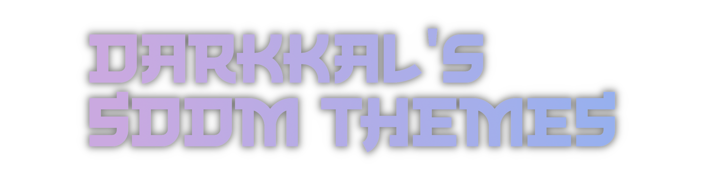
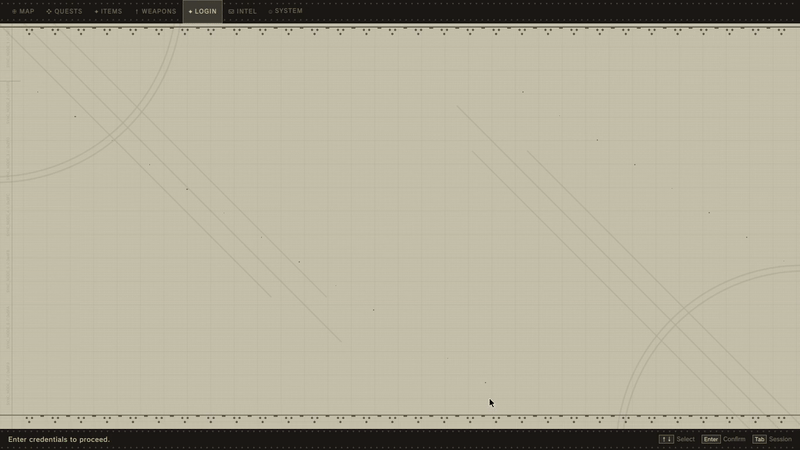
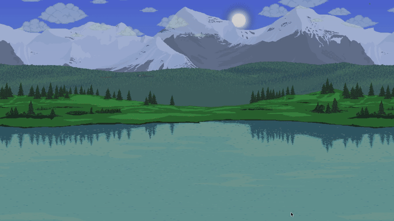
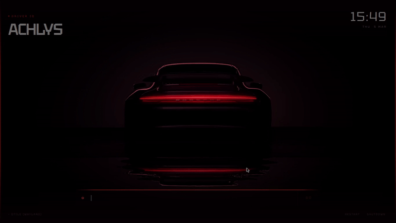

<p align="center">
<pre align="center">
<a href="#sddm">sᴅᴅᴍ​​</a>  •  <a href="#quickshell">​ǫᴜɪᴄᴋsʜᴇʟʟ​</a>  •  <a href="#gallery">​ɢᴀʟʟᴇʀʏ</a>  •  <a href="#credits">​ᴄʀᴇᴅɪᴛs</a>
</pre>
</p>




<div align="left">
  <a href="https://github.com/sddm/sddm"></a>
  <a href="https://www.qt.io"></a>
  
  <div align="right">
    <details>
      <summary>☕ sᴜᴘᴘᴏʀᴛ ᴍʏ ᴡᴏʀᴋ</summary>
      <p align="right">
        <br>
        
        <br><br>
        <i>Means a lot, tysm <3</i>
      </p>
    </details>
  </div>
</div>

---

<br>

###  ᴏᴠᴇʀᴠɪᴇᴡ
A simple collection of all the lockscreen themes I've made. It comes with a theme changer script so you don't have to worry about moving files manually. 

<br>

---

<div align="center">
  <h2 id="sddm">  ꜱᴅᴅᴍ ꜱᴇᴛᴜᴘ  </h2>
</div>

### ⚡ ɪɴꜱᴛᴀʟʟᴀᴛɪᴏɴ ᴀɴᴅ ᴜꜱᴀɢᴇ

**1. Install Dependencies:**
Make sure you have these packages installed via your system's package manager (names might differ slightly on your distro):
- `sddm`, `qt5-graphicaleffects`, `qt5-multimedia`, `qt5-quickcontrols`, `qt5-quickcontrols2`, `qt5-svg`

**2. Use the Setup Script:**
Simply run the interactive script to select and apply your themes. As long as you have the dependencies, this will handle the rest.
> [!IMPORTANT]
> The `setup.sh` script works best with `fzf` installed, but will fallback to a simple list if needed.

```sh
chmod +x setup.sh
./setup.sh
```

<br>

---

<div align="center">
  <h2 id="quickshell">  ʟᴏᴄᴋꜱᴄʀᴇᴇɴ ꜱᴇᴛᴜᴘ (ǫᴜɪᴄᴋꜱʜᴇʟʟ)  </h2>
</div>

If you're here to use these as lockscreen themes, then you can use QUICKSHELL to do so.

**1. Install Target Dependencies:**
You will need Quickshell and the Qt6 multimedia tools to render the assets.
*   Arch Linux (AUR): `quickshell` or `quickshell-git`
*   Required Qt6 dependencies: `qt6-declarative`, `qt6-5compat`, `qt6-multimedia`, `qt6-multimedia-ffmpeg` (or `qt6-multimedia-gstreamer`)

**2. Run the Interactive Installer:**
Execute the `quickshell.sh` script to set up your target lockscreen theme and create the needed directories in your local environment.
```sh
chmod +x quickshell.sh
./quickshell.sh
```

**3. Configure your Window Manager:**
Once completed, simply bind a keyboard shortcut in your Window Manager's configuration file (e.g., Qtile, Hyprland, Sway or i3) to trigger `~/.local/share/quickshell-lockscreen/lock.sh`.

<br>

---

<div align="center">
  <h2 id="gallery"> ◈ ᴛʜᴇ ᴄᴏʟʟᴇᴄᴛɪᴏɴ ◈ </h2>
</div>

<br>

### ◈ NieR: Automata

<div align="center">
  
</div>

<br>

### ◈ Terraria

<div align="center">
  
</div>

<br>

### ◈ Enfield

<div align="center">
  
</div>

<br>

### ◈ Sword

<div align="center">
  
</div>

<br>

### ◈ Paper

<div align="center">
  
</div>

<br>

### ◈ Windows 7

<div align="center">
  
</div>

<br>

### ◈ Cyberpunk

<div align="center">
  
</div>

<br>

### ◈ TUI

<div align="center">
  
</div>

<br>

### ◈ Porsche

<div align="center">
  
</div>

<br>

### ◈ Genshin Impact

<div align="center">
  
</div>

<br>

---

<div align="center">
  <h2 id="credits">  ᴄʀᴇᴅɪᴛꜱ ᴀɴᴅ ɢʀᴀᴛɪᴛᴜᴅᴇ  </h2>
</div>

* **Pumphium** -  A huge thanks to this lil guy for helping me with the theme suggestions and debugging with me.
* **Qt/QML Community** — For the powerful framework that makes these themes possible.
* **Unixporn** — For the aesthetic inspiration and feedback.

---

<div align="center">
  <br>
  <p><i>Make your login your own. Stay ricey.</i></p>
</div>
